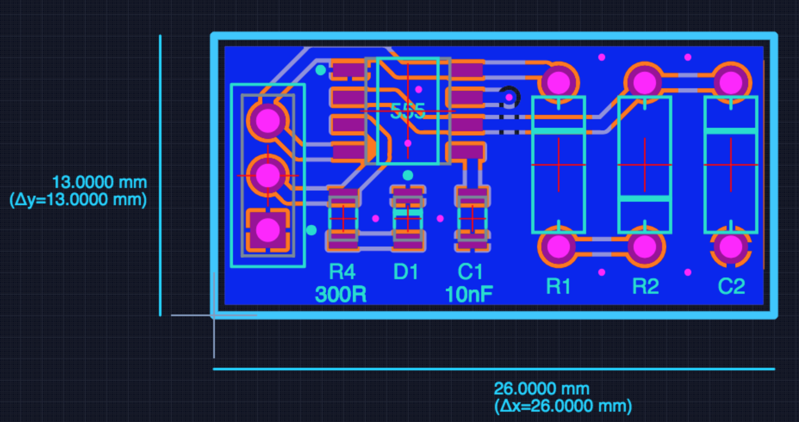

# 555 astable

A little board with a 555 timer IC and a few components around it to create an astable oscillator. The output of the oscillator is available on a header so it can be used of-board but there is also an LED so you can see it blinking. The components that control the oscillation frequency are through-hole components so they can be loaded and swapped out easily; the components you shouldn't need to change (including the 555 timer IC) are surface mount.

## Design files

This board was designed using the [Upverter](https://upverter.com) web service.

The schematic, board layout and bill of materials can be viewed [here](https://upverter.com/Trebuchetindustries/af8b6780e9c3c265/555-astable/). Exports from Upverter are [available in a subdirectory](./Upverter%20exports).

## Licence

Copyright © 2018 Phil Baldwin

This work is licensed under a Creative Commons Attribution-ShareAlike 4.0 International License.

You should have received a copy of the license along with this work. If not, see <http://creativecommons.org/licenses/by-sa/4.0/>.
