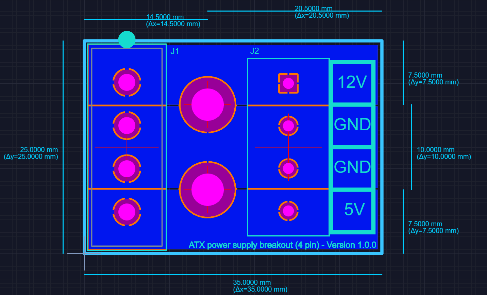

# ATX power supply breakout (4 pin)

Well I was already making the "[PC internal USB power](../PC%20internal%20USB%20power)" board for a friend and I thought it'd be a simple matter to fork it and make this as well ... so I did.

Basically this a board breaks out the 4 pin power connector from an ATX power supply (the one that powers hard drives, not the one that provides extra power to the CPU) to 4 labelled screw terminals.

## Design files

This board was designed using the [Upverter](https://upverter.com) web service.

The schematic, board layout and bill of materials can be viewed [here](https://upverter.com/Trebuchetindustries/455794e1972b6737/ATX-power-supply-breakout-4-pin/). Exports from Upverter are [available in a subdirectory](./Upverter%20exports).

## TODO

* [ ] Find a SATA power connector and add a foot print for it to the board as an alternative to the Molex power connector
    * https://www.digikey.com/short/jfjj8t
    * https://www.digikey.com/short/jfjj8t

## Licence

Copyright © 2018 Phil Baldwin

This work is licensed under a Creative Commons Attribution-ShareAlike 4.0 International License.

You should have received a copy of the license along with this work. If not, see <http://creativecommons.org/licenses/by-sa/4.0/>.
