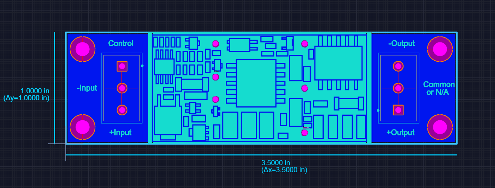

# ASD10H breakout

.....

## Design files

This board was designed using the [Upverter](https://upverter.com) web service.

The schematic, board layout and bill of materials can be viewed [here](https://upverter.com/Trebuchetindustries/7a9232088d0491e3/ASD10H-breakout/). Exports from Upverter are [available in a subdirectory](./Upverter%20exports).

## Ordering PCB

[This PCB can be ordered](https://PCBs.io/share/4qq6b) from the [pcbs.io](https://pcbs.io) service.

<a href="https://PCBs.io/share/4qq6b"></img></a>

## Licence

Copyright © 2018 Phil Baldwin

This work is licensed under a Creative Commons Attribution-ShareAlike 4.0 International License.

You should have received a copy of the license along with this work. If not, see <http://creativecommons.org/licenses/by-sa/4.0/>.
