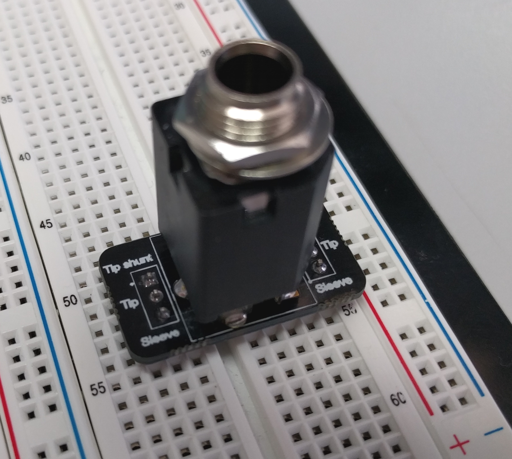

# Breadboard adaptor for 6.35mm audio jack

*Warning: Design not yet tested*

Breakout board for a 6.35mm audio connector so I can more easily get audio signals into my breadboard.

## Design files

This board was designed using the [Upverter](https://upverter.com) web service.

The schematic, board layout and bill of materials can be viewed [here](https://upverter.com/Trebuchetindustries/3db4c9d9acf5b70b/Breadboard-adaptor-for-635mm-audio-jack/). Exports from Upverter are available in a subdirectory.

## TODO

* [ ] Consider expanding board to 5 pins on either side and allowing any of the Switchcraft 110x series of connectors to be used.
* [ ] Shrink board so it leaves more breadboard holes available

## Licence

Copyright © 2016, 2017 Phil Baldwin

This work is licensed under a Creative Commons Attribution-ShareAlike 4.0 International License.

You should have received a copy of the license along with this work. If not, see <http://creativecommons.org/licenses/by-sa/4.0/>.
