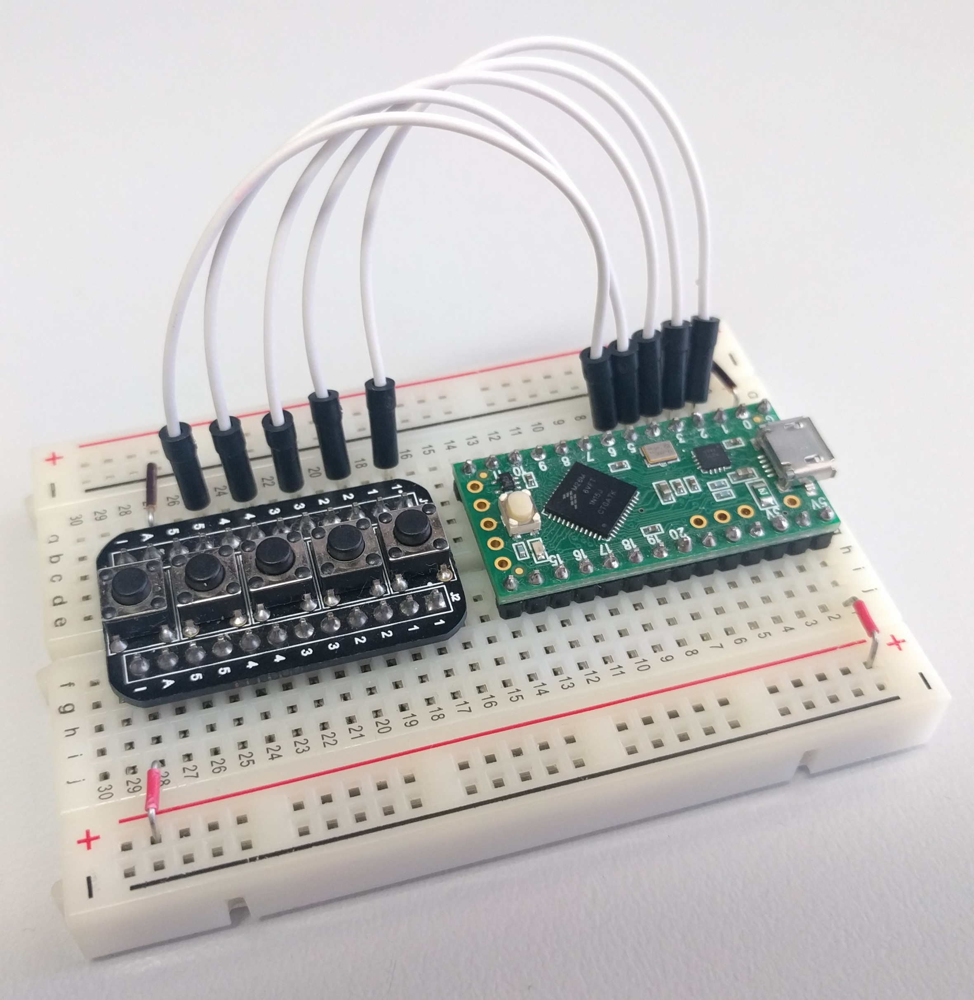

# Breadboard buttons (1x5)

Buttons and resistors on a breadboard compatible PCB.

While the button is not being pressed, the input signal (numbered 1 through 5) is connected through a resistor to the inactive (I) pin. When the button is pressed, the input signal is connected to the active (A) pin. This enables you to select whether the buttons are active high or active low (or anything else really) simply by connecting a different voltage to the active (A) and inactive (I) pins.

If you want the input to go high when a button is pressed (active high), connect VCC to the active (A) pin and ground to the inactive (I) pin. If you want the input to go low when a button is pressed (active low) connect ground to the active (A) pin and VCC to the inactive (I) pin.

## Design files

This board was designed using the [Upverter](https://upverter.com) web service.

The schematic, board layout and bill of materials can be viewed [here](https://upverter.com/Trebuchetindustries/3e25da6e03fb6ce9/Breadboard-buttons-1x5/). Exports from Upverter are [available in a subdirectory](./Upverter%20exports).

## Ordering PCB

[This PCB can be ordered](https://PCBs.io/share/4Q2d5) from the [pcbs.io](https://pcbs.io) service.

<a href="https://PCBs.io/share/4Q2d5"></img></a>

## Licence

Copyright © 2017 Phil Baldwin

This work is licensed under a Creative Commons Attribution-ShareAlike 4.0 International License.

You should have received a copy of the license along with this work. If not, see <http://creativecommons.org/licenses/by-sa/4.0/>.
