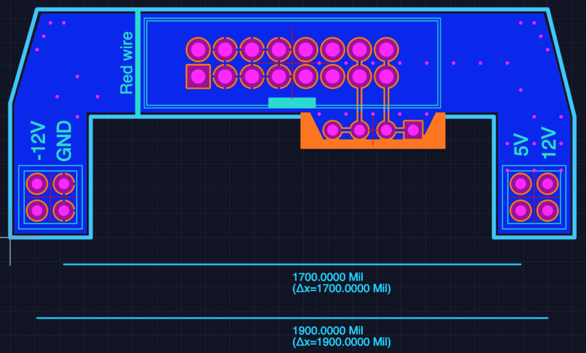

# Breadboard power injector - Eurorack

.....

## Design files

This board was designed using the [Upverter](https://upverter.com) web service.

The schematic, board layout and bill of materials can be viewed [here](https://upverter.com/Trebuchetindustries/6de52b97d458ebd5/Breadboard-power-injector---Eurorack/). Exports from Upverter are [available in a subdirectory](./Upverter%20exports).

## Licence

Copyright © 2019 Phil Baldwin

This work is licensed under a Creative Commons Attribution-ShareAlike 4.0 International License.

You should have received a copy of the license along with this work. If not, see <http://creativecommons.org/licenses/by-sa/4.0/>.
