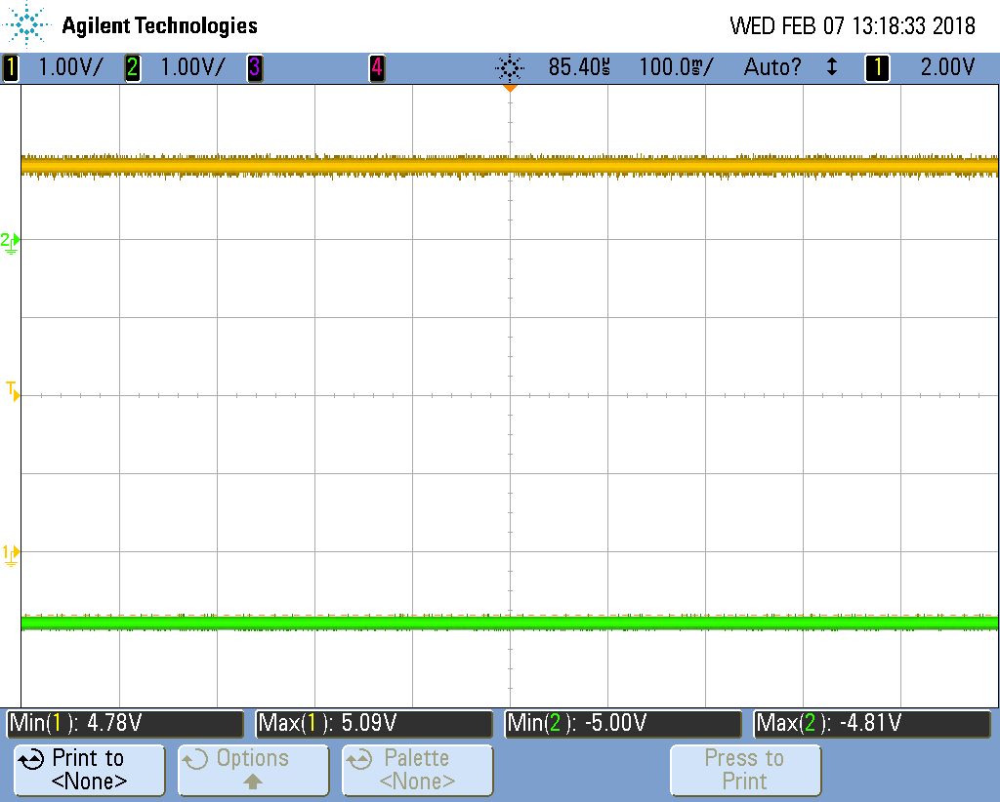
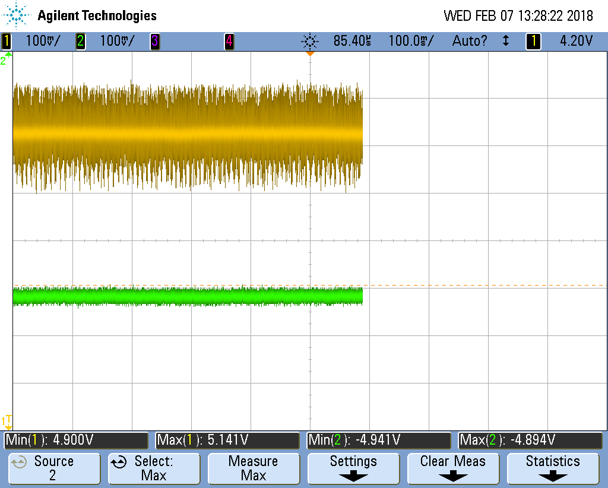
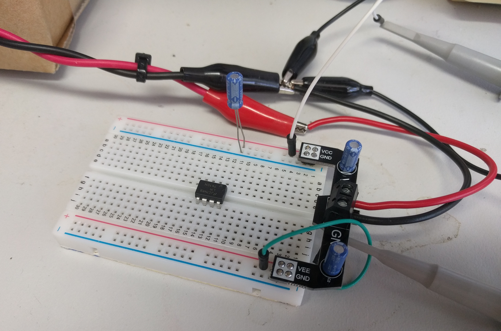
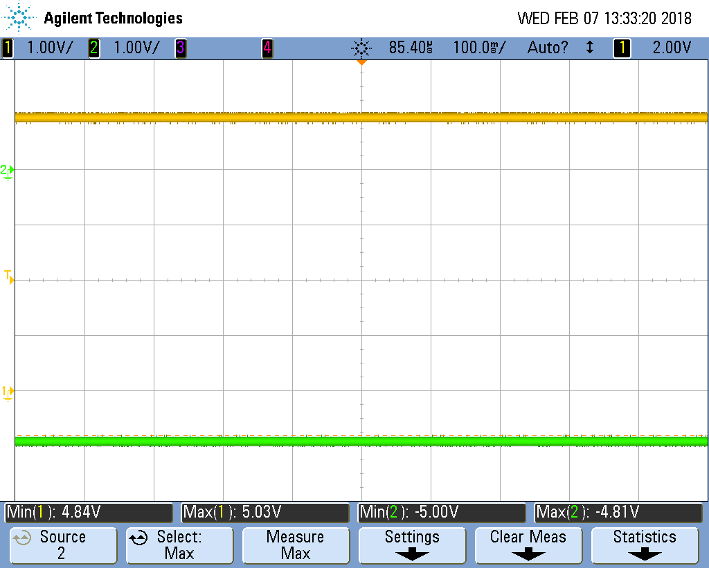
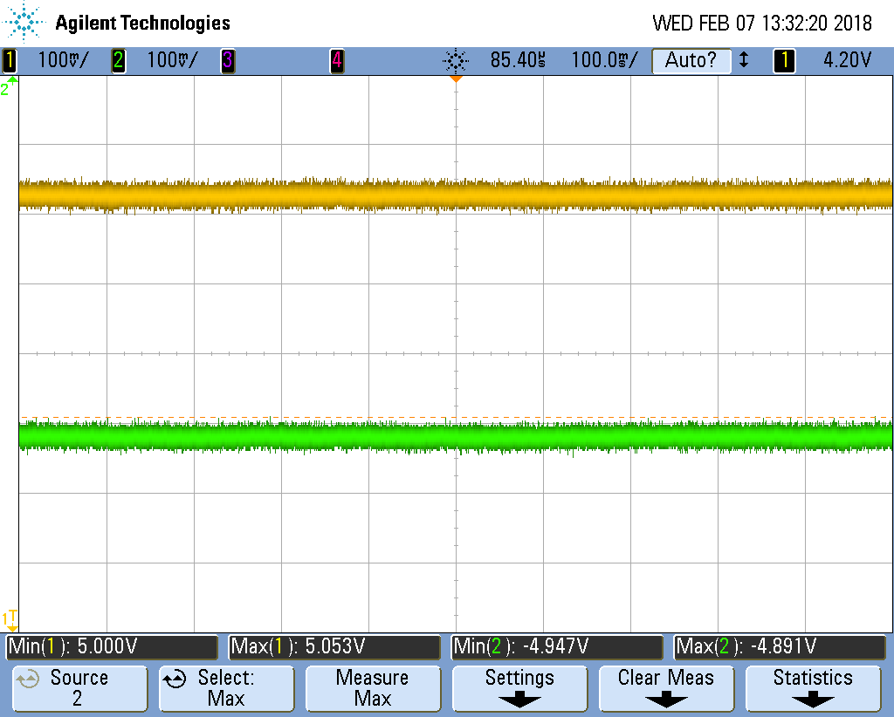

# Testing Breadboard power injector - Inverting

Testing conducted with version 1.0 PCB. Board was built with a Texas Instruments LMC7660IMX/NOPB (Digikey part number[LMC7660IMX/NOPBCT-ND](https://www.digikey.com/product-detail/en/texas-instruments/LMC7660IMX-NOPB/LMC7660IMX-NOPBCT-ND/1010555)) IC and two 10 μf 50 volt electrolydic capacitors.

## Test setup 1

Bench-top power supply set to 5 volts and connected to GND and VCC screw terminals on PCB via about 50cm of wire. Oscilloscope probe one connected to VCC 0.1" header and oscilloscope probe two connected to VEE 0.1" header. Both oscilloscope probes given a ground reference by connecting them to the GND screw terminal.

Same set up as above, just with oscilloscope zoomed in a little more (100 millivolts per division).

## Test setup 2

PCB plugged into a breadboard with a 10 μf 50 volt electrolydic capacitor connected between the VCC and GND breadboard strips. Bench-top power supply set to 5 volts and connected to GND and VCC screw terminals on PCB via about 50cm of wire. Oscilloscope probe one connected to VCC strip on the breadboard and oscilloscope probe two connected to the VEE strip on the breadboard. Both oscilloscope probes given a ground reference by connecting them to the GND screw terminal.

Same set up as above, just with oscilloscope zoomed in a little more (100 millivolts per division).

## Test setup 3

TODO: Test with a load on both supply rails.
