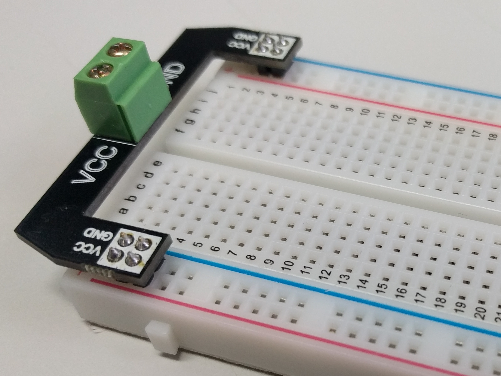

# Breadboard power injector

A simple way to get power and ground connected to both of the vertical rails on your breadboard.

## Related boards

If you want a negative voltage supply as well, check out the [Breadboard power injector - inverting](../Breadboard%20power%20injector%20-%20inverting/) board.

## Design files

This board was designed using the [Upverter](https://upverter.com) web service.

The schematic, board layout and bill of materials can be viewed [here](https://upverter.com/Trebuchetindustries/1fb8f03207e953b4/Breadboard-power-injector/). Exports from Upverter are [available in a subdirectory](./Upverter%20exports).

The bill of materials lists specific a part number for the 2 pin screw terminal block but really any old 2 pin screw terminal block with a 5mm pitch should work.

## Ordering PCB

[This PCB can be ordered](https://PCBs.io/share/42JjX) from the [pcbs.io](https://pcbs.io) service.

<a href="https://PCBs.io/share/42JjX"></img></a>

## Licence

Copyright © 2017 Phil Baldwin

This work is licensed under a Creative Commons Attribution-ShareAlike 4.0 International License.

You should have received a copy of the license along with this work. If not, see <http://creativecommons.org/licenses/by-sa/4.0/>.
