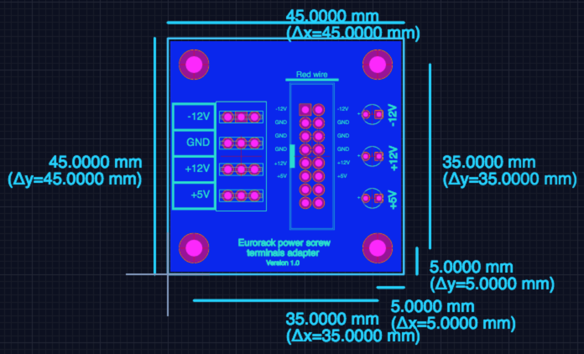

# Eurorack power screw terminals adapter

A power supply connector for Eurorack modular synthesizer connected to a block of screw terminals, so you can:

* Power your Eurorack synth modules by putting power into the screw terminals OR
* Breakout of the power supply rails from a Eurorack power supply (or power bus board) by using the screw terminals as power outputs

Also, there are some LEDs to indicate when power is present.

I made this board by cutting down [this existing design](../ATX%20to%20Eurorack%20power%20supply%20adaptor/).

## Design files

This board was designed using the [Upverter](https://upverter.com) web service.

The schematic, board layout and bill of materials can be viewed [here](https://upverter.com/Trebuchetindustries/f0b63092cbbe587c/Eurorack-power-screw-terminals-adapter/). Exports from Upverter are [available in a subdirectory](./Upverter%20exports).

## Ordering PCB

[This PCB can be ordered](https://PCBs.io/share/zMkxO) from the [pcbs.io](https://pcbs.io) service.

<a href="https://PCBs.io/share/zMkxO"></img></a>

## Licence

Copyright © 2018 Phil Baldwin

This work is licensed under a Creative Commons Attribution-ShareAlike 4.0 International License.

You should have received a copy of the license along with this work. If not, see <http://creativecommons.org/licenses/by-sa/4.0/>.
