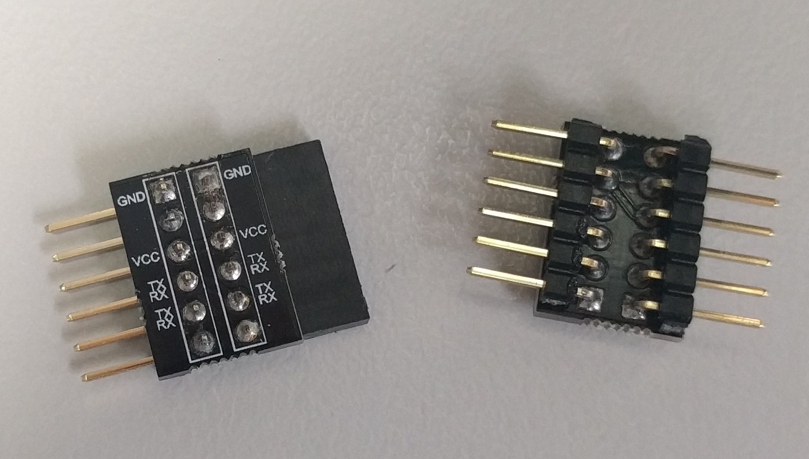

# FTDI cross over

This tiny little board provides two FTDI-compatible 6-pin 0.1" headers, with the VCC and GND (power and ground) pins from each header linked to the corresponding pin on the other header, and the TX and RX (transmit and receive) pins crossed over.

You can populate this board with pretty much and 1x6 pin 0.1" headers; male or female, straight or right angle, it all works.

Why would I want this? Well sometimes I need to plug two FTDI (USB to serial) cables together or I just need to cross over the RX and TX lines when plugging an FTDI cable into some strange device. I could even use two of these boards in cases where I don't want the TX and RX lines crossed over, e.g. as a connector gender conversion.

This board serves a similar function to the null modem and gender change over adaptors I use with [DE-9 connectors](https://en.wikipedia.org/wiki/D-subminiature) ... I've got plenty of those hanging around, and now I've got these.

Before I made this board, I a built a much crappier looking board by hand:

## Design files

This board was designed using the [Upverter](https://upverter.com) web service.

The schematic, board layout and bill of materials can be viewed [here](https://upverter.com/Trebuchetindustries/1e0caf0e18ecd19f/FTDI-cross-over/). Exports from Upverter are [available in a subdirectory](./Upverter%20exports).

## Ordering PCB

[This PCB can be ordered](https://PCBs.io/share/8DXOP) from the [pcbs.io](https://pcbs.io) service.

<a href="https://PCBs.io/share/8DXOP"></img></a>

## Licence

Copyright © 2017, 2018 Phil Baldwin

This work is licensed under a Creative Commons Attribution-ShareAlike 4.0 International License.

You should have received a copy of the license along with this work. If not, see <http://creativecommons.org/licenses/by-sa/4.0/>.
