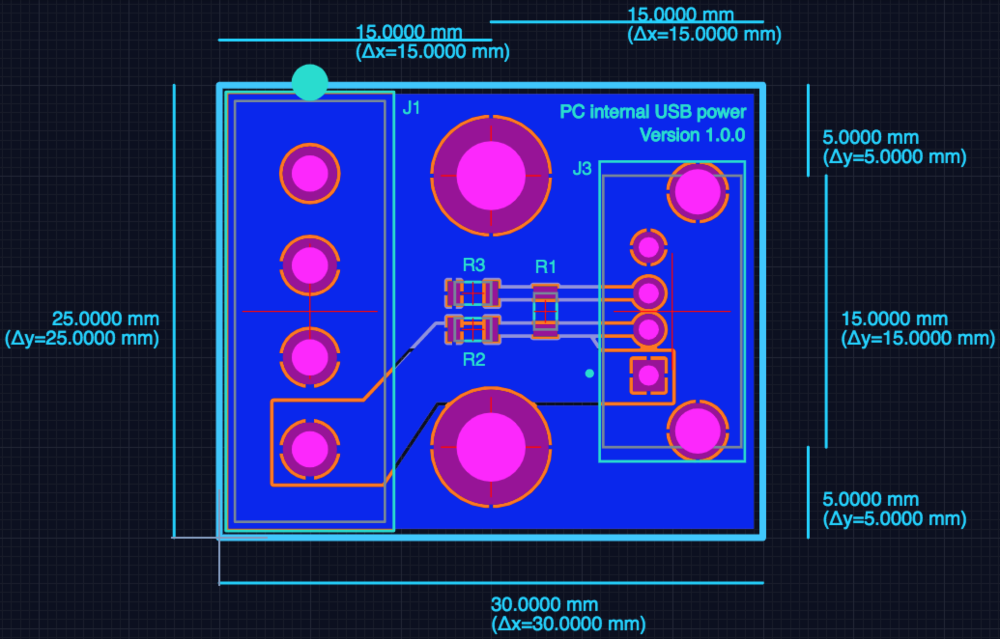

# PC internal USB power

Need to power a USB device off an ATX power supply? Maybe a screen for that cool briefcase computer you're working on? Well this board is for you.

## Design files

This board was designed using the [Upverter](https://upverter.com) web service.

The schematic, board layout and bill of materials can be viewed [here](https://upverter.com/Trebuchetindustries/74fc6e0a4b830742/PC-internal-USB-power/). Exports from Upverter are [available in a subdirectory](./Upverter%20exports).

### Bill of materials

| Designator | Description                                                     | Manufacturer    | Manufacturer Part Number | Suppliers          | Package            | Quantity |
| ---------- | --------------------------------------------------------------- | --------------- | ------------------------ | ------------------ | ------------------ | -------- |
| J1         | 4 pin Molex 8981 Series w/FT                                    | Molex           | 0015244449               | Digi-Key WM9132-ND |                    |     1    |
| J3         | USB - A, Receptacle Connector 4 Position Through Hole, Vertical | TE Connectivity | 1734366-1                |                    | USB - A            |     1    |
| R1         | Generic Resistor - 100 ohm                                      | Generic         | Resistor (100)           |                    | 0805 (2012 metric) |     1    |
| R2 R3      | Generic Resistor - 5 Kohm                                       | Generic         | Resistor (5000000)       |                    | 0805 (2012 metric) |     2    |

## TODO

* [ ] Find a SATA power connector and add a foot print for it to the board as an alternative to the Molex power connector
    * https://www.digikey.com/short/jfjj8t
    * https://www.digikey.com/short/jfjj8t

## Ordering PCB

[This PCB can be ordered](https://PCBs.io/share/rmPnb) from the [pcbs.io](https://pcbs.io) service.

<a href="https://PCBs.io/share/rmPnb"></img></a>

## Licence

Copyright © 2018 Phil Baldwin

This work is licensed under a Creative Commons Attribution-ShareAlike 4.0 International License.

You should have received a copy of the license along with this work. If not, see <http://creativecommons.org/licenses/by-sa/4.0/>.
