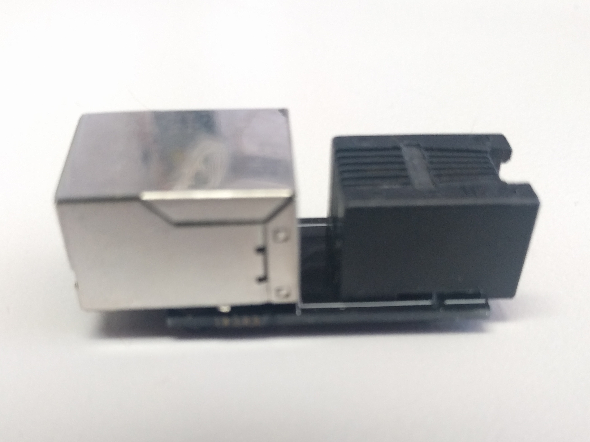

# RJ45 to RJ11 adaptor

*Warning: Design not yet tested*

Pin for pin adaptor to RJ45 and RJ11 connectors. Pins 1-6 on the RJ11 are connected to pins 1-6 on the RJ45. Pins 7 and 8 on the RJ45 are not connected.

## Design files

This board was designed using the [Upverter](https://upverter.com) web service.

The schematic, board layout and bill of materials can be viewed [here](https://upverter.com/Trebuchetindustries/a729da65489fed32/RJ45-to-RJ11-adaptor/). Exports from Upverter are [available in a subdirectory](./Upverter%20exports).

## TODO

* [ ] RJ11 was smaller than PCB allows for ..... fix part footprint and shrink PCB
* [ ] RJ45 had extra metal spikes coming down from the side which the PCB did not account for
* [ ] Check used components against bill of materials
* [ ] Bottom silkscreen text is readable but only barely ... lines overlap slightly
    * [ ] Consider simplifying it and then bumping up the font size
    * [ ] Consider making a sticker to go on the RJ45 connecter which says the same thing (more space there and I can print better quality than the PCB manufacturer I used)
    * [ ] Compare silkscreen quality between different PCB manufacturers
* [ ] Photos
* [ ] Test
* [ ] Name and version number on bottom silkscreen
* [ ] Consider better looking RJ11 connector
* [ ] Check whether I am using the correct terminology (RJ11/RJ45) ... I'm pretty sure that I'm not

## Licence

Copyright © 2016 Phil Baldwin

This work is licensed under a Creative Commons Attribution-ShareAlike 4.0 International License.

You should have received a copy of the license along with this work. If not, see <http://creativecommons.org/licenses/by-sa/4.0/>.
