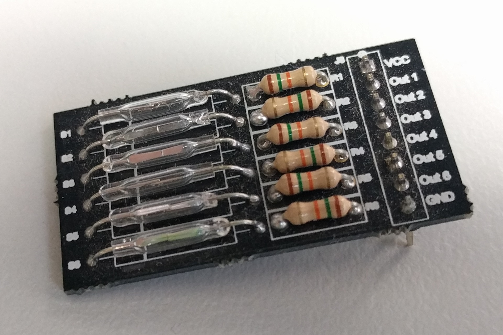

# Reed switch holder

This is a quick and simple board designed to hold 6 reed switches in a row, approximately equal distance apart so I can experiment with some spinning magnets for possible MIDI applications.

## Design files

This board was designed using the [Upverter](https://upverter.com) web service.

The schematic, board layout and bill of materials can be viewed [here](https://upverter.com/Trebuchetindustries/779c092dc3c8a9ac/Reed-switch-holder/). Exports from Upverter are [available in a subdirectory](./Upverter%20exports).

The bill of materials lists specific part numbers for the 0.1" header and reed switches but really any old 0.1" header and reed switches should work.

## TODO

* [ ] Test
* [x] Remove component labels from silkscreen (unnecessary and too small to see properly anyway)
* [ ] Name and version number on bottom silkscreen
* [ ] Consider adding LEDs
* [ ] Consider surface mount resistors
* [ ] Consider how to easily swap out broken reed switches and/or protect them from damage
* [ ] Consider screw holes
* [ ] Consider alternative connectors
* [x] Photos
* [ ] Consider increasing size of reed switch drill holes and pads
    * https://electronics.stackexchange.com/questions/85292/what-pad-hole-drill-size-is-appropriate-for-a-given-through-hole-lead-diameter
    * Datasheet says leads are 0.5 mm diameter

## Licence

Copyright © 2016, 2017 Phil Baldwin

This work is licensed under a Creative Commons Attribution-ShareAlike 4.0 International License.

You should have received a copy of the license along with this work. If not, see <http://creativecommons.org/licenses/by-sa/4.0/>.
