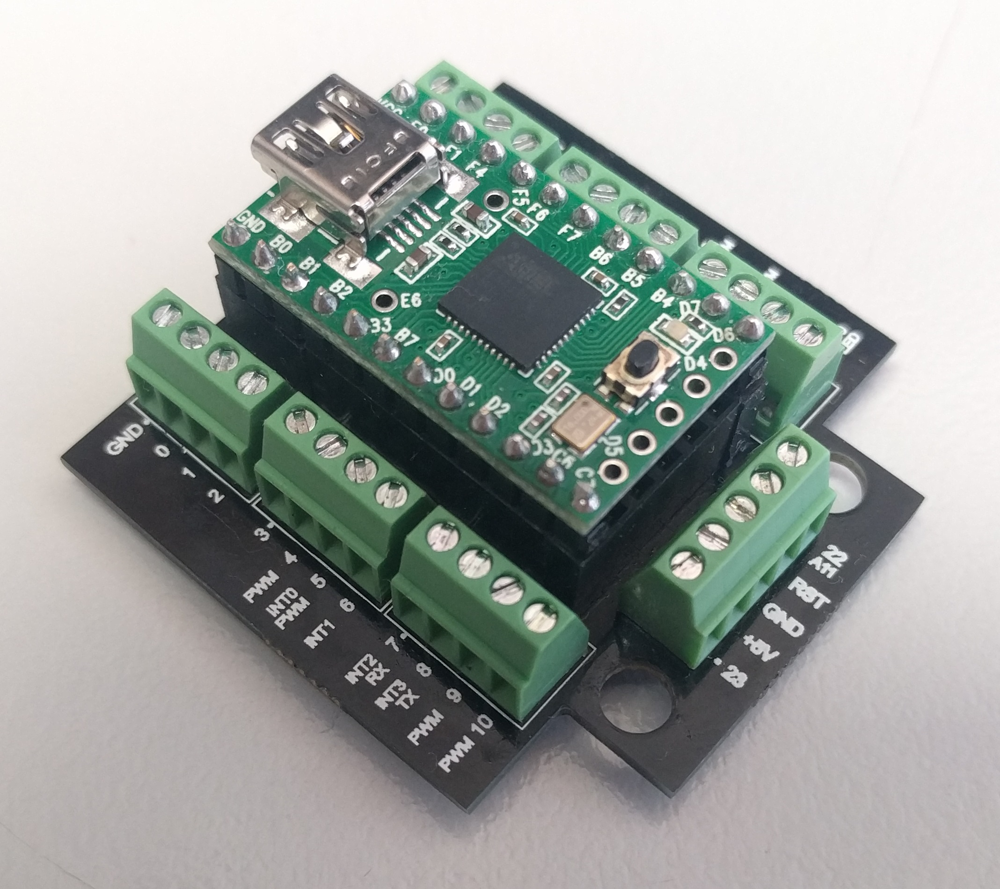

# Teensy 2.0 screws

This is a quick and simple board designed to break out most of the pins on the [Teensy 2.0](https://www.pjrc.com/store/teensy.html) board to screw terminals.

I used 0.1" (2.54 mm) pitch screw terminals because it's the same pitch as the pins on the Teensy. I used three 4-pin terminal blocks along the long sides of the Teensy (rather than a single 12-pin terminal block) because they're more common and flexible ... and I already had several on hand.

When mounting the Teensy, it is important to make sure the Teensy's pins line up with the silkscreen labels on this PCB. An easy way to do this is to use the pin labelled "GND" on the top right of the Teensy board to align the Teensy with the screw terminal labelled "GND" on the top right of this PCB (as shown in the picture below).

## Design files

This board was designed using the [Upverter](https://upverter.com) web service.

The schematic, board layout and bill of materials can be viewed [here](https://upverter.com/Trebuchetindustries/f769853e2825a702/Teensy-screws/). Exports from Upverter are [available in a subdirectory](./Upverter%20exports).

## TODO

* [ ] Text on bottom silkscreen need to be swapped around
    * [ ] Document how this two sided thing is supposed to work, it's a bit weird
* [ ] Test
* [ ] Check conductivity
* [ ] Screw holes / cable tie holes
    * [ ] Figure out what I intended
    * [ ] Figure out what I want
    * [ ] Test
    * [ ] Change if necessary
    * [ ] Document
* [x] Photos
* [ ] Describe how to mount the Teensy so that it matches the silkscreen labels on the top AND on the bottom.
* [ ] Check screw holes ... I think the back two are too close to the board edge

## Licence

Copyright © 2016 Phil Baldwin

This work is licensed under a Creative Commons Attribution-ShareAlike 4.0 International License.

You should have received a copy of the license along with this work. If not, see <http://creativecommons.org/licenses/by-sa/4.0/>.
